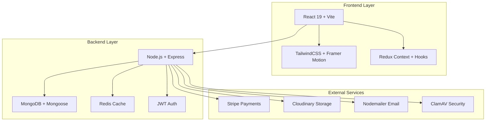

# Careers NITKKR - Faculty Recruitment Portal

<div align="center">


**Enterprise-Grade Faculty Recruitment Management System**

[](https://nodejs.org/)
[](https://reactjs.org/)
[](https://www.mongodb.com/)
[](LICENSE)

A comprehensive, scalable, and secure web-based recruitment management system for National Institute of Technology Kurukshetra (NITKKR) that streamlines the entire faculty recruitment lifecycle from job posting to final selection.

</div>

## 🚀 Quick Start

```bash
# Clone and setup
git clone <repository-url> && cd Careers-NITKKR
chmod +x setup.sh && ./setup.sh

# Start development servers
npm run dev
```

**Access**: [Frontend](http://localhost:3000) • [Backend](http://localhost:8000) • [Health Check](http://localhost:8000/health)

## 🏗️ Architecture

### System Overview

Careers NITKKR follows a modern microservices-ready architecture with clear separation of concerns:



### Technology Stack

**Frontend Technologies:**

- **React 19.2.0** - Latest with concurrent features
- **Vite 7.3.1** - Ultra-fast build tool
- **TailwindCSS 4.1.18** - Utility-first CSS framework
- **Framer Motion 12.34.0** - Production-ready animations
- **React Router 7.13.0** - Modern routing
- **Axios 1.13.5** - HTTP client with interceptors

**Backend Technologies:**

- **Node.js ≥18.0.0** - LTS runtime environment
- **Express 5.2.1** - Web application framework
- **MongoDB ≥5.0** - NoSQL database with Mongoose ODM
- **Redis ≥6.0** - In-memory caching and session storage
- **JWT 9.0.3** - Stateless authentication
- **Zod 4.3.6** - Runtime type validation

**Integration Services:**

- **Stripe 20.4.0** - Payment processing
- **Cloudinary 1.41.3** - Cloud storage and CDN
- **Nodemailer 8.0.1** - Email communications
- **ClamAV 2.4.0** - Malware scanning
- **bcryptjs 3.0.3** - Password hashing

## 📊 Features

### Core Functionality

#### 🎯 Job Management

- **Dynamic Job Creation**: Flexible job posting with custom fields
- **Eligibility Criteria**: Comprehensive age, experience, and qualification requirements
- **Application Fee Structure**: Category-based pricing (General, SC/ST, OBC, EWS, PwD)
- **Document Management**: Advertisement, application forms, and annexures
- **Timeline Control**: Scheduled publishing and automated closing
- **Department Organization**: Hierarchical department structure

#### 📝 Application Processing

- **Multi-Step Forms**: Progressive application completion
- **Document Upload**: Secure file upload with malware scanning
- **Real-time Validation**: Instant feedback on form completion
- **Application Tracking**: Complete status history and notifications
- **Payment Integration**: Seamless Stripe payment processing
- **Data Snapshots**: Job configuration preservation at application time

#### 👥 User Management

- **Role-Based Access Control**: Four-tier permission system
  - **Applicant**: Application management and profile updates
  - **Department Head**: Department-specific job and application oversight
  - **Admin**: Full job and application management
  - **Super Admin**: System configuration and user management
- **Profile Management**: Comprehensive user profiles with preferences
- **Authentication**: JWT-based with refresh token rotation
- **Email Verification**: OTP-based secure email verification

#### 💳 Payment Processing

- **Category-Based Pricing**: Different fees for different applicant categories
- **Secure Checkout**: Stripe-hosted payment pages
- **Instant Confirmation**: Real-time payment status updates
- **Receipt Generation**: Digital receipts with transaction details
- **Refund Management**: Automated and manual refund processing
- **Payment History**: Complete transaction audit trail

#### 📧 Communication System

- **Automated Notifications**: Email alerts for application updates
- **Deadline Reminders**: Automated reminders before application deadlines
- **Status Updates**: Real-time notifications for application status changes
- **System Announcements**: Broadcast messages to all users
- **Personalized Communication**: Targeted emails based on user roles

#### 📈 Analytics & Reporting

- **Application Metrics**: Real-time application statistics
- **Job Performance**: Analytics on job posting effectiveness
- **Demographic Insights**: Applicant demographic analysis
- **Revenue Tracking**: Payment and revenue analytics
- **Department Reports**: Department-specific recruitment metrics
- **Export Capabilities**: CSV and PDF report generation

### Security Features

#### 🔐 Authentication & Authorization

- **Multi-Factor Authentication**: JWT with refresh token rotation
- **Role-Based Permissions**: Granular access control system
- **Session Management**: Secure token-based sessions
- **Password Security**: bcrypt hashing with salt rounds
- **Account Lockout**: Protection against brute force attacks

#### 🛡️ Application Security

- **Input Validation**: Comprehensive Zod schema validation
- **SQL Injection Prevention**: Parameterized queries with Mongoose
- **XSS Protection**: Content Security Policy and input sanitization
- **CSRF Protection**: CSRF tokens for state-changing operations
- **Rate Limiting**: API abuse prevention with configurable limits

#### 📁 File Security

- **Malware Scanning**: ClamAV integration for all uploads
- **File Type Validation**: Strict file type and size restrictions
- **Cloud Storage**: Secure Cloudinary storage with CDN
- **Access Control**: Role-based file access permissions
- **Audit Logging**: Complete file access and modification logs

#### 🌐 Network Security

- **HTTPS Enforcement**: SSL/TLS for all communications
- **Security Headers**: Helmet middleware for HTTP security
- **CORS Configuration**: Cross-origin resource sharing controls
- **API Rate Limiting**: DDoS protection and abuse prevention
- **IP Whitelisting**: Admin panel access restrictions

## 📁 Project Structure

```
Careers-NITKKR/
├── client/                     # React Frontend Application
│   ├── public/                # Static assets & PWA config
│   │   ├── icons/            # Application icons & favicons
│   │   ├── images/           # Static images
│   │   └── manifest.json     # Progressive Web App configuration
│   ├── src/
│   │   ├── components/       # Reusable UI components
│   │   │   ├── common/       # Shared components (Button, Modal, etc.)
│   │   │   ├── forms/        # Form-specific components
│   │   │   ├── layout/       # Layout components (Header, Sidebar)
│   │   │   └── ui/           # UI primitives (Input, Select, etc.)
│   │   ├── pages/            # Page-level components
│   │   │   ├── auth/         # Authentication pages
│   │   │   ├── jobs/         # Job-related pages
│   │   │   ├── application/  # Application pages
│   │   │   ├── admin/        # Admin dashboard pages
│   │   │   └── profile/      # User profile pages
│   │   ├── hooks/            # Custom React hooks
│   │   ├── services/         # API service layer
│   │   ├── utils/            # Utility functions
│   │   ├── context/          # React contexts for state management
│   │   ├── constants/        # Application constants & enums
│   │   ├── assets/           # Static assets (images, fonts)
│   │   ├── styles/           # Global styles and Tailwind config
│   │   ├── App.jsx           # Root application component
│   │   └── main.jsx          # Application entry point
│   ├── package.json          # Frontend dependencies
│   ├── vite.config.js        # Vite build configuration
│   ├── tailwind.config.js    # TailwindCSS configuration
│   └── README.md             # Frontend-specific documentation
├── server/                    # Node.js Backend API
│   ├── src/
│   │   ├── controllers/      # Request handlers & business logic
│   │   │   ├── auth/         # Authentication controllers
│   │   │   ├── jobs/         # Job management controllers
│   │   │   ├── application/  # Application processing controllers
│   │   │   ├── admin/        # Admin operation controllers
│   │   │   └── payment/      # Payment processing controllers
│   │   ├── models/           # MongoDB data models & schemas
│   │   │   ├── User.js       # User account model
│   │   │   ├── Job.js        # Job posting model
│   │   │   ├── Application.js # Application model
│   │   │   ├── Department.js # Department model
│   │   │   ├── Payment.js    # Payment transaction model
│   │   │   ├── Notice.js     # Notice/announcement model
│   │   │   └── AuditLog.js   # Audit trail model
│   │   ├── routes/           # API route definitions
│   │   │   ├── auth.routes.js
│   │   │   ├── job.routes.js
│   │   │   ├── application.routes.js
│   │   │   ├── admin.routes.js
│   │   │   ├── payment.routes.js
│   │   │   └── index.js      # Route aggregation
│   │   ├── middlewares/      # Custom Express middleware
│   │   │   ├── auth.middleware.js      # Authentication middleware
│   │   │   ├── validation.middleware.js # Input validation
│   │   │   ├── error.middleware.js     # Global error handling
│   │   │   ├── security.middleware.js  # Security headers & protection
│   │   │   └── upload.middleware.js    # File upload handling
│   │   ├── services/         # Business logic & external service integrations
│   │   │   ├── auth.service.js         # Authentication & token management
│   │   │   ├── email.service.js        # Email communication service
│   │   │   ├── payment.service.js      # Stripe payment processing
│   │   │   ├── file.service.js         # File upload & Cloudinary integration
│   │   │   ├── notification.service.js  # Notification management
│   │   │   └── background.service.js    # Background job processing
│   │   ├── utils/            # Utility functions & helpers
│   │   │   ├── logger.js      # Structured logging utility
│   │   │   ├── validator.js    # Input validation helpers
│   │   │   ├── helpers.js      # General utility functions
│   │   │   ├── constants.js    # System constants
│   │   │   └── database.js     # Database utilities
│   │   ├── validators/        # Input validation schemas (Zod)
│   │   │   ├── auth.validator.js
│   │   │   ├── job.validator.js
│   │   │   ├── application.validator.js
│   │   │   └── payment.validator.js
│   │   ├── config/           # Configuration files
│   │   │   ├── database.js    # Database connection configuration
│   │   │   ├── cloudinary.js  # Cloudinary configuration
│   │   │   ├── stripe.js      # Stripe payment configuration
│   │   │   └── redis.js       # Redis cache configuration
│   │   ├── scripts/          # Database management scripts
│   │   │   ├── seed.js        # Database seeding script
│   │   │   ├── migrate.js     # Data migration script
│   │   │   ├── cleanup.js     # Data cleanup script
│   │   │   └── backup.js      # Database backup script
│   │   ├── constants.js      # Application-wide constants
│   │   ├── app.js            # Express application configuration
│   │   └── index.js          # Server entry point
│   ├── docs/                 # API documentation
│   │   ├── system.md         # System architecture documentation
│   │   ├── api.md            # API endpoint documentation
│   │   ├── swagger.yaml      # OpenAPI specification
│   │   └── postman.json      # Postman collection
│   ├── tests/                # Test suites
│   │   ├── unit/             # Unit tests
│   │   ├── integration/      # Integration tests
│   │   ├── fixtures/         # Test data fixtures
│   │   └── helpers/          # Test helper utilities
│   ├── .env.example          # Environment variables template
│   ├── package.json          # Backend dependencies
│   └── README.md             # Backend-specific documentation
├── docs/                     # Project documentation
│   ├── deployment/           # Deployment guides
│   │   ├── docker.md         # Docker deployment
│   │   ├── production.md     # Production deployment
│   │   └── monitoring.md     # Monitoring setup
│   ├── development/          # Development guides
│   │   ├── setup.md          # Development setup
│   │   ├── contributing.md   # Contribution guidelines
│   │   └── troubleshooting.md # Common issues
│   ├── user-guide/           # End-user documentation
│   │   ├── applicant.md      # Applicant guide
│   │   ├── admin.md          # Admin guide
│   │   └── faq.md            # Frequently asked questions
│   └── architecture/         # System architecture documentation
│       ├── overview.md       # High-level architecture
│       ├── database.md       # Database design
│       └── security.md       # Security architecture
├── scripts/                  # Build & deployment scripts
│   ├── setup.sh             # Project initialization script
│   ├── deploy.sh            # Deployment automation script
│   ├── backup.sh            # Database backup script
│   ├── migrate.sh            # Data migration script
│   └── health-check.sh       # System health check script
├── tests/                    # E2E and integration tests
│   ├── e2e/                  # End-to-end tests
│   ├── integration/          # Integration tests
│   └── fixtures/             # Test data and fixtures
├── infrastructure/           # Infrastructure as Code
│   ├── docker/               # Docker configurations
│   │   ├── Dockerfile.dev    # Development container
│   │   ├── Dockerfile.prod   # Production container
│   │   └── docker-compose.yml # Multi-service setup
│   ├── kubernetes/           # Kubernetes manifests
│   │   ├── namespace.yaml    # Namespace configuration
│   │   ├── deployment.yaml   # Application deployment
│   │   ├── service.yaml      # Service configuration
│   │   └── ingress.yaml     # Ingress configuration
│   └── terraform/           # Terraform configurations
│       ├── main.tf          # Main configuration
│       ├── variables.tf     # Input variables
│       └── outputs.tf       # Output variables
├── monitoring/               # Monitoring & observability
│   ├── prometheus/           # Metrics collection
│   │   ├── prometheus.yml   # Prometheus configuration
│   │   └── rules.yml        # Alerting rules
│   ├── grafana/              # Dashboards & visualization
│   │   ├── dashboards/      # Grafana dashboards
│   │   └── provisioning/    # Auto-provisioning
│   └── elk-stack/            # Logging stack
│       ├── elasticsearch/   # Elasticsearch configuration
│       ├── logstash/        # Logstash configuration
│       └── kibana/          # Kibana configuration
├── .github/                  # GitHub configuration
│   ├── workflows/           # CI/CD pipelines
│   │   ├── ci.yml          # Continuous integration
│   │   ├── deploy.yml       # Deployment pipeline
│   │   └── security.yml     # Security scanning
│   ├── ISSUE_TEMPLATE/      # Issue templates
│   └── PULL_REQUEST_TEMPLATE.md
├── .vscode/                  # VS Code configuration
│   ├── settings.json        # Editor settings
│   ├── extensions.json      # Recommended extensions
│   ├── launch.json          # Debug configurations
│   └── tasks.json           # Build tasks
├── .gitignore                # Git ignore rules
├── .env.example              # Environment variables template
├── docker-compose.yml        # Development Docker setup
├── docker-compose.prod.yml   # Production Docker setup
├── package.json              # Root package configuration
├── lerna.json                # Monorepo configuration
└── README.md                 # This file
```

## 🛠️ Installation

### Prerequisites

#### System Requirements

- **Node.js** ≥18.0.0 (LTS version recommended)
- **npm** ≥8.0.0 or **yarn** ≥1.22.0
- **MongoDB** ≥5.0 (Community or Atlas)
- **Redis** ≥6.0 (for production caching)
- **Git** ≥2.30.0
- **Docker** ≥20.10.0 (optional, for containerized deployment)

#### Development Environment

- **IDE**: VS Code with recommended extensions
- **Browser**: Chrome DevTools for debugging
- **API Testing**: Postman or Insomnia
- **Database GUI**: MongoDB Compass (optional)

### Setup Process

#### 1. Clone Repository

```bash
git clone <repository-url>
cd Careers-NITKKR
```

#### 2. Install Dependencies

```bash
# Install root dependencies
npm install

# Install server dependencies
cd server && npm install && cd ..

# Install client dependencies
cd client && npm install && cd ..
```

#### 3. Environment Configuration

```bash
# Copy environment templates
cp server/.env.example server/.env
cp client/.env.example client/.env

# Configure server environment
# Edit server/.env with your configuration:
# - MongoDB connection string
# - JWT secrets
# - Stripe keys
# - Email configuration
# - Cloudinary credentials

# Configure client environment
# Edit client/.env with:
# - API URL
# - Environment-specific settings
```

#### 4. Database Setup

```bash
# Start MongoDB service
mongod

# Initialize database with seed data
cd server && npm run seed && cd ..
```

#### 5. Start Development Servers

```bash
# Start all services (recommended)
npm run dev

# Or start individually:
# Terminal 1 - Backend
cd server && npm run dev

# Terminal 2 - Frontend
cd client && npm run dev
```

#### 6. Verify Installation

- **Frontend**: http://localhost:3000
- **Backend**: http://localhost:8000
- **Health Check**: http://localhost:8000/health
- **API Documentation**: http://localhost:8000/api-docs

## 🔧 Development

### Development Commands

#### Root Level Commands

```bash
npm run dev              # Start all development services
npm run build            # Build for production
npm run test             # Run test suite
npm run test:coverage    # Run tests with coverage
npm run lint             # Run ESLint
npm run format           # Format code with Prettier
npm run clean            # Clean build artifacts
```

#### Backend Commands

```bash
cd server
npm run dev              # Start development server with nodemon
npm start                # Start production server
npm test                 # Run backend tests
npm run test:watch       # Run tests in watch mode
npm run seed             # Seed database with initial data
npm run migrate          # Run database migrations
npm run backup           # Backup database
```

#### Frontend Commands

```bash
cd client
npm run dev              # Start Vite development server
npm run build            # Build for production
npm run preview          # Preview production build
npm run test             # Run frontend tests
npm run lint             # Run ESLint
npm run type-check       # Run TypeScript type checking
```

### Code Quality

#### ESLint Configuration

```bash
# Check for linting errors
npm run lint

# Fix linting errors automatically
npm run lint:fix

# Check specific file
npx eslint src/components/Button.jsx
```

#### Prettier Formatting

```bash
# Format all files
npm run format

# Check formatting without changing files
npm run format:check

# Format specific file
npx prettier --write src/App.jsx
```

#### Performance Monitoring

```bash
# Check response times
curl -w "@curl-format.txt" -o /dev/null -s http://localhost:8000/api/v1/jobs

# Monitor memory usage
docker stats careers-backend

# Check database performance
mongostat --host localhost:27017
```

## 📄 License

Proprietary to NIT Kurukshetra. All rights reserved.

---

**Last Updated**: March 2026 • **Version**: 1.0.0 • **Maintained by**: NIT Kurukshetra Development Team
