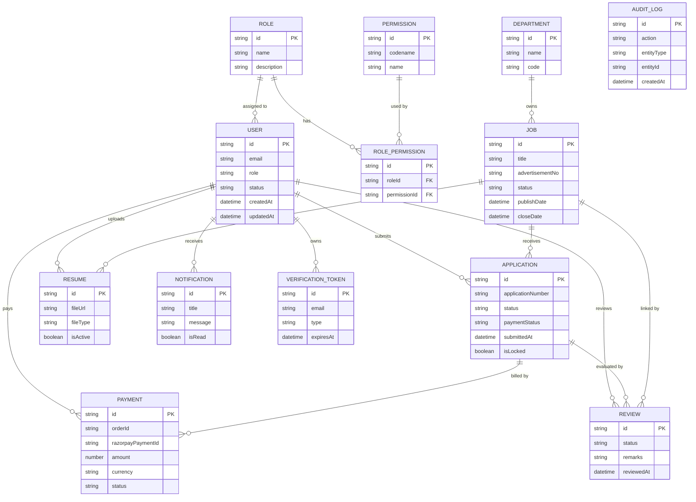

# Careers-NITKKR: Production ERD (Relational + Document-aware)

## 1) Full Entity List (Production-level)

1. User
2. Role
3. Permission (optional role-permission matrix)
4. Department
5. Job
6. Application
7. Payment
8. Resume
9. Notification
10. VerificationToken
11. AuditLog
12. Review
13. JobDocuments / JobSection / JobCustomField (embedded in Job)
14. ApplicationStatusHistory (embedded array in Application)

> NOTE: Your current implementation uses MongoDB and embeds some objects. This ERD is designed for PostgreSQL + MongoDB conceptual mapping.

---

## 2) Textual ERD (Structured)

### 2.1 User

- PK: `id` (UUID / ObjectId)
- email (STRING, unique, NOT NULL, indexed)
- passwordHash (STRING, NOT NULL)
- role (ENUM: STUDENT, ADMIN, REVIEWER, SUPER_ADMIN, NOT_SET)
- firstName, lastName, phone, dateOfBirth, nationality
- isEmailVerified (BOOLEAN, default false)
- status (ENUM: ACTIVE, INACTIVE, BANNED)
- deletedAt (TIMESTAMP NULL)
- createdAt, updatedAt
- indexes: email, role, deletedAt

Relationships:

- One User -> Many Applications
- One User -> Many Payments
- One User -> Many Notifications
- One User -> Many VerificationToken
- One User -> Many Reviews (if reviewer)

### 2.2 Role

- PK: `id` (UUID)
- name (ENUM/STRING, unique)
- description
- isDefault
- createdAt, updatedAt

### 2.3 Permission

- PK: `id`
- codename (STRING, unique)
- name, description

### 2.4 RolePermission (junction)

- roleId FK -> Role(id)
- permissionId FK -> Permission(id)
- unique(roleId, permissionId)

### 2.5 Department

- PK: `id`
- name (STRING, unique)
- code (STRING, unique)
- description
- isDeleted
- createdAt, updatedAt

### 2.6 Job

- PK: `id`
- title, advertisementNo (UNIQUE)
- departmentId FK -> Department(id)
- designation, payLevel, grade
- vacancies (JSON/structured)
- applicationFee (JSON)
- location, jobType, shift
- status (ENUM: DRAFT, OPEN, CLOSED, ARCHIVED)
- publishDate, closeDate
- createdBy FK -> User(id)
- isDeleted, deletedAt
- createdAt, updatedAt

Relationships:

- One Department -> Many Jobs
- One Job -> Many Applications
- One Job -> Many JobDocuments (or embed as array)

### 2.8 Resume

- PK: `id`
- userId FK -> User(id)
- fileUrl
- cloudinaryId
- fileType
- checksum/hash
- uploadedAt
- isActive
- isDeleted
- createdAt, updatedAt

### 2.9 Application

- PK: `id`
- applicationNumber (STRING, UNIQUE)
- userId FK -> User(id)
- jobId FK -> Job(id)
- status (ENUM: DRAFT, SUBMITTED, UNDER_REVIEW, SHORTLISTED, REJECTED, SELECTED, WITHDRAWN)
- paymentStatus (ENUM: PENDING, PAID, FAILED, REFUNDED)
- submittedAt
- isLocked (BOOLEAN)
- lockedAt
- jobSnapshot JSON (title, advertisementNo, department, fees, requiredSections)
- sections JSON (per-section data with pdfUrl, imageUrl, isComplete, verification)
- reviewNotes, reviewedBy FK -> User(id), reviewedAt
- statusHistory JSON array
- createdAt, updatedAt
- isDeleted, deletedAt

Constraints:

- Unique constraint on (userId, jobId)

### 2.10 Payment

- PK: `id`
- orderId (STRING, unique)
- razorpayPaymentId (STRING, sparse unique for success)
- userId FK -> User(id)
- applicationId FK -> Application(id)
- amount
- currency
- status (ENUM: PENDING, PAID, FAILED, REFUNDED)
- paymentMethod
- rawVerificationData JSON
- createdAt, updatedAt
- isDeleted

### 2.11 VerificationToken

- PK: `id`
- email (STRING, indexed)
- otpHash (STRING)
- type (ENUM: EMAIL_VERIFICATION, PASSWORD_RESET, TWO_FACTOR, APPLICATION_OTP)
- expiresAt (TIMESTAMP)
- createdAt, updatedAt

Unique constraint: (email, type) active

### 2.12 Notification

- PK: `id`
- userId FK -> User(id)
- title, message
- type (ENUM: SYSTEM, PAYMENT, APPLICATION, JOB)
- isRead (BOOLEAN)
- referenceType, referenceId (optional: job/application/payment)
- createdAt, readAt
- isDeleted

### 2.13 AuditLog

- PK: `id`
- userId FK -> User(id)
- action
- entityType
- entityId
- metadata JSON
- ipAddress
- userAgent
- createdAt

### 2.14 Review

- PK: `id`
- applicationId FK -> Application(id)
- reviewerId FK -> User(id)
- status (ENUM: PENDING, COMPLETED, REJECTED)
- score, remarks
- reviewedAt
- createdAt, updatedAt

### 2.15 JobDocument (optional)

- PK: `id`
- jobId FK -> Job(id)
- type (ENUM: ADVERTISEMENT, FORM, ANNEXURE)
- label
- url
- cloudinaryId
- uploadedAt

---

## 3) Relationships (Cardinality)

1. User(1) -> Application(N)
2. User(1) -> Payment(N)
3. User(1) -> Notification(N)
4. User(1) -> VerificationToken(N)
5. User(1) -> Review(N)
6. Role(1) -> User(N)
7. Role(N) <-> Permission(N) via RolePermission
8. Department(1) -> Job(N)
9. Job(1) -> Application(N)
10. Application(1) -> Payment(1..N), with payment type data
11. Application(1) -> Review(N)
12. User(1) -> Resume(N) (or 1-to-many if multiple versions)
13. Job(1) -> JobDocument(N)
14. Application(1) -> embedded statusHistory (1..N)
15. Application(1) -> SectionData map

---

## 4) Mermaid.js ER Diagram Code

---

## 5) Table-wise SQL-style Schema (DDL Summary)

### 🧑‍💻 `users`

| Column            | Type         | Constraints                            |
| ----------------- | ------------ | -------------------------------------- |
| id                | UUID         | PRIMARY KEY, DEFAULT gen_random_uuid() |
| email             | VARCHAR(255) | UNIQUE, NOT NULL, INDEX                |
| password_hash     | TEXT         | NOT NULL                               |
| role              | VARCHAR(32)  | NOT NULL, DEFAULT 'STUDENT'            |
| first_name        | VARCHAR(100) |                                        |
| last_name         | VARCHAR(100) |                                        |
| phone             | VARCHAR(20)  |                                        |
| date_of_birth     | DATE         |                                        |
| nationality       | VARCHAR(50)  | DEFAULT 'Indian'                       |
| is_email_verified | BOOLEAN      | DEFAULT FALSE                          |
| status            | VARCHAR(20)  | DEFAULT 'ACTIVE'                       |
| deleted_at        | TIMESTAMP    | NULL                                   |
| created_at        | TIMESTAMP    | DEFAULT now()                          |
| updated_at        | TIMESTAMP    | DEFAULT now()                          |

### 🛡️ `roles`

| Column      | Type        | Constraints      |
| ----------- | ----------- | ---------------- |
| id          | UUID        | PRIMARY KEY      |
| name        | VARCHAR(32) | UNIQUE, NOT NULL |
| description | TEXT        |                  |
| created_at  | TIMESTAMP   |                  |
| updated_at  | TIMESTAMP   |                  |

### 🔐 `permissions`

| Column      | Type         | Constraints      |
| ----------- | ------------ | ---------------- |
| id          | UUID         | PRIMARY KEY      |
| codename    | VARCHAR(100) | UNIQUE, NOT NULL |
| name        | VARCHAR(100) | NOT NULL         |
| description | TEXT         |                  |

### 🔗 `role_permissions`

| Column        | Type | Constraints                     |
| ------------- | ---- | ------------------------------- |
| id            | UUID | PRIMARY KEY                     |
| role_id       | UUID | FK → roles.id, NOT NULL         |
| permission_id | UUID | FK → permissions.id, NOT NULL   |
|               |      | UNIQUE (role_id, permission_id) |

### 🏢 `companies`

| Column        | Type         | Constraints      |
| ------------- | ------------ | ---------------- |
| id            | UUID         | PRIMARY KEY      |
| name          | VARCHAR(255) | UNIQUE, NOT NULL |
| website       | VARCHAR(255) |                  |
| contact_email | VARCHAR(255) |                  |
| phone         | VARCHAR(50)  |                  |
| address       | TEXT         |                  |
| city          | VARCHAR(100) |                  |
| state         | VARCHAR(100) |                  |
| country       | VARCHAR(100) |                  |
| is_verified   | BOOLEAN      | DEFAULT FALSE    |
| created_by    | UUID         | FK → users.id    |
| created_at    | TIMESTAMP    |                  |
| updated_at    | TIMESTAMP    |                  |

### 🏫 `departments`

| Column      | Type         | Constraints      |
| ----------- | ------------ | ---------------- |
| id          | UUID         | PRIMARY KEY      |
| name        | VARCHAR(200) | UNIQUE, NOT NULL |
| code        | VARCHAR(50)  | UNIQUE, NOT NULL |
| description | TEXT         |                  |
| is_deleted  | BOOLEAN      | DEFAULT FALSE    |
| created_at  | TIMESTAMP    |                  |
| updated_at  | TIMESTAMP    |                  |

### 💼 `jobs`

| Column           | Type         | Constraints                   |
| ---------------- | ------------ | ----------------------------- |
| id               | UUID         | PRIMARY KEY                   |
| title            | VARCHAR(255) | NOT NULL                      |
| advertisement_no | VARCHAR(100) | UNIQUE, NOT NULL              |
| department_id    | UUID         | FK → departments.id, NOT NULL |
| designation      | VARCHAR(100) |                               |
| pay_level        | VARCHAR(50)  |                               |
| grade            | VARCHAR(50)  |                               |
| vacancies        | JSONB        |                               |
| application_fee  | JSONB        |                               |
| status           | VARCHAR(30)  | DEFAULT 'DRAFT'               |
| publish_date     | TIMESTAMP    |                               |
| close_date       | TIMESTAMP    |                               |
| is_deleted       | BOOLEAN      | DEFAULT FALSE                 |
| created_by       | UUID         | FK → users.id                 |
| created_at       | TIMESTAMP    |                               |
| updated_at       | TIMESTAMP    |                               |

### 📄 `resumes`

| Column        | Type        | Constraints             |
| ------------- | ----------- | ----------------------- |
| id            | UUID        | PRIMARY KEY             |
| user_id       | UUID        | FK → users.id, NOT NULL |
| file_url      | TEXT        | NOT NULL                |
| cloudinary_id | TEXT        |                         |
| file_type     | VARCHAR(50) |                         |
| is_active     | BOOLEAN     | DEFAULT TRUE            |
| is_deleted    | BOOLEAN     | DEFAULT FALSE           |
| uploaded_at   | TIMESTAMP   | DEFAULT now()           |

### 📝 `applications`

| Column             | Type         | Constraints                 |
| ------------------ | ------------ | --------------------------- |
| id                 | UUID         | PRIMARY KEY                 |
| application_number | VARCHAR(100) | UNIQUE, NOT NULL            |
| user_id            | UUID         | FK → users.id, NOT NULL     |
| job_id             | UUID         | FK → jobs.id, NOT NULL      |
| status             | VARCHAR(30)  | DEFAULT 'DRAFT', NOT NULL   |
| payment_status     | VARCHAR(30)  | DEFAULT 'PENDING', NOT NULL |
| job_snapshot       | JSONB        | NOT NULL                    |
| sections           | JSONB        | DEFAULT '{}'                |
| submitted_at       | TIMESTAMP    |                             |
| is_locked          | BOOLEAN      | DEFAULT FALSE               |
| locked_at          | TIMESTAMP    |                             |
| reviewed_by        | UUID         | FK → users.id, NULL         |
| reviewed_at        | TIMESTAMP    | NULL                        |
| review_notes       | TEXT         | NULL                        |
| status_history     | JSONB        | DEFAULT '[]'                |
| is_deleted         | BOOLEAN      | DEFAULT FALSE               |
| created_at         | TIMESTAMP    | DEFAULT now()               |
| updated_at         | TIMESTAMP    | DEFAULT now()               |
|                    |              | UNIQUE (user_id, job_id)    |

### 💳 `payments`

| Column                | Type          | Constraints                                           |
| --------------------- | ------------- | ----------------------------------------------------- |
| id                    | UUID          | PRIMARY KEY                                           |
| order_id              | VARCHAR(200)  | UNIQUE, NOT NULL                                      |
| razorpay_payment_id   | VARCHAR(200)  | NULL                                                  |
| user_id               | UUID          | FK → users.id, NOT NULL                               |
| application_id        | UUID          | FK → applications.id, NOT NULL                        |
| amount                | NUMERIC(12,2) | NOT NULL                                              |
| currency              | VARCHAR(10)   | DEFAULT 'INR', NOT NULL                               |
| status                | VARCHAR(20)   | DEFAULT 'PENDING', NOT NULL                           |
| payment_method        | VARCHAR(50)   | NULL                                                  |
| raw_verification_data | JSONB         |                                                       |
| created_at            | TIMESTAMP     | DEFAULT now()                                         |
| updated_at            | TIMESTAMP     | DEFAULT now()                                         |
|                       |               | UNIQUE (application_id, status) WHERE status = 'PAID' |

### 🔑 `verification_tokens`

| Column     | Type         | Constraints          |
| ---------- | ------------ | -------------------- |
| id         | UUID         | PRIMARY KEY          |
| email      | VARCHAR(255) | NOT NULL             |
| otp_hash   | TEXT         | NOT NULL             |
| type       | VARCHAR(30)  | NOT NULL             |
| expires_at | TIMESTAMP    | NOT NULL             |
| created_at | TIMESTAMP    | DEFAULT now()        |
| updated_at | TIMESTAMP    | DEFAULT now()        |
|            |              | UNIQUE (email, type) |

### 🔔 `notifications`

| Column         | Type         | Constraints             |
| -------------- | ------------ | ----------------------- |
| id             | UUID         | PRIMARY KEY             |
| user_id        | UUID         | FK → users.id, NOT NULL |
| title          | VARCHAR(255) | NOT NULL                |
| message        | TEXT         | NOT NULL                |
| type           | VARCHAR(30)  | NOT NULL                |
| is_read        | BOOLEAN      | DEFAULT FALSE           |
| reference_type | VARCHAR(100) | NULL                    |
| reference_id   | UUID         | NULL                    |
| created_at     | TIMESTAMP    | DEFAULT now()           |
| read_at        | TIMESTAMP    | NULL                    |

### 🧾 `audit_logs`

| Column      | Type         | Constraints         |
| ----------- | ------------ | ------------------- |
| id          | UUID         | PRIMARY KEY         |
| user_id     | UUID         | FK → users.id, NULL |
| action      | VARCHAR(180) | NOT NULL            |
| entity_type | VARCHAR(100) | NOT NULL            |
| entity_id   | UUID         | NULL                |
| metadata    | JSONB        | NULL                |
| ip_address  | VARCHAR(100) | NULL                |
| user_agent  | TEXT         | NULL                |
| created_at  | TIMESTAMP    | DEFAULT now()       |

### ✅ `reviews`

| Column         | Type        | Constraints                    |
| -------------- | ----------- | ------------------------------ |
| id             | UUID        | PRIMARY KEY                    |
| application_id | UUID        | FK → applications.id, NOT NULL |
| reviewer_id    | UUID        | FK → users.id, NOT NULL        |
| status         | VARCHAR(30) | DEFAULT 'PENDING', NOT NULL    |
| remarks        | TEXT        |                                |
| reviewed_at    | TIMESTAMP   | NULL                           |
| created_at     | TIMESTAMP   | DEFAULT now()                  |
| updated_at     | TIMESTAMP   | DEFAULT now()                  |

---

## 🔗 Relationships Summary

- `users` (1) → `applications` (N)
- `users` (1) → `payments` (N)
- `users` (1) → `notifications` (N)
- `users` (1) → `resumes` (N)
- `users` (1) → `reviews` (N)
- `companies` (1) → `jobs` (N)
- `departments` (1) → `jobs` (N)
- `jobs` (1) → `applications` (N)
- `applications` (1) → `payments` (N)
- `applications` (1) → `reviews` (N)
- `roles` (1) → `users` (N)
- `roles` (N) ↔ `permissions` (N) via `role_permissions`

## ⚡ Notes

- All tables are normalized to avoid redundancy (3NF-level design).
- Soft deletes using `is_deleted` / `deleted_at` are included for `jobs`, `applications`, `users`, `departments`, `resumes`.
- Indexed columns should include FK columns and high-selectivity fields (`email`, `status`, `application_number`, `order_id`).
- Use JSONB fields for flexible data (`vacancies`, `application_fee`, `job_snapshot`, `sections`, `raw_verification_data`) while keeping core relational integrity.
- Important uniqueness constraints are explicitly documented (e.g. `user_id + job_id` in `applications`).

## 9) Next Step

Use this ERD as your authoritative backend data design and align API payload contracts to these entities. If you want, I can now generate a PostgreSQL DDL migration script directly from this design.
