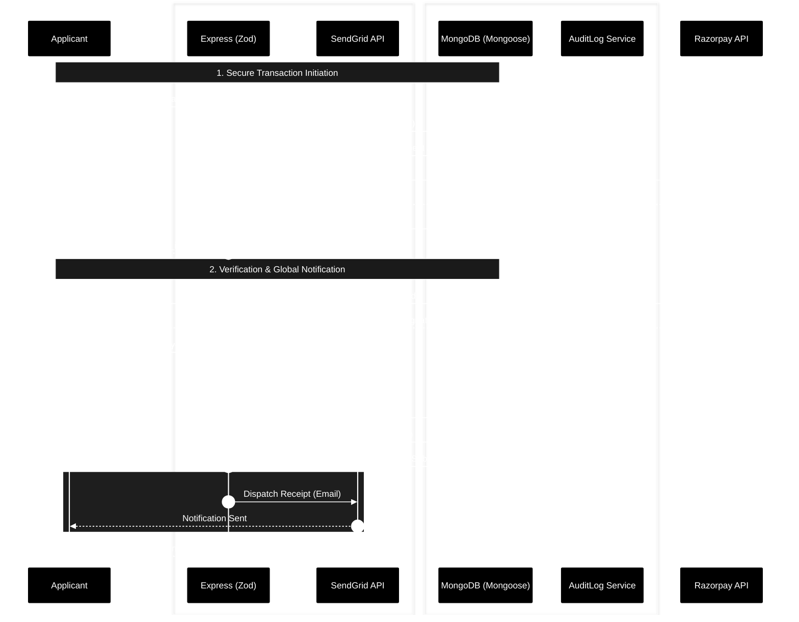

```mermaid
%%{init: {
  'theme': 'base',
  'themeVariables': {
    'primaryColor': '#ffffff',
    'primaryTextColor': '#000000',
    'primaryBorderColor': '#ffffff',
    'lineColor': '#ffffff',
    'secondaryColor': '#ffffff',
    'tertiaryColor': '#ffffff',
    'mainBkg': '#000000',
    'textColor': '#ffffff',
    'actorBkg': '#000000',
    'actorBorder': '#ffffff',
    'actorTextColor': '#ffffff',
    'actorLineColor': '#ffffff',
    'signalColor': '#ffffff',
    'signalTextColor': '#ffffff',
    'labelBoxBkgColor': '#000000',
    'labelBoxBorderColor': '#ffffff',
    'labelTextColor': '#ffffff',
    'loopTextColor': '#ffffff',
    'noteBkgColor': '#1a1a1a',
    'noteTextColor': '#ffffff',
    'noteBorderColor': '#ffffff',
    'sequenceNumberColor': '#ffffff',
    'sectionBkgColor': '#000000',
    'sectionTextColor': '#ffffff'
  }
}}%%
sequenceDiagram
    autonumber
    
    participant Applicant
    box "Backend Services" #1a1a1a
        participant API as Express (Zod)
        participant Mailer as SendGrid API
    end
    box "Persistence Layer" #000000
        participant DB as MongoDB (Mongoose)
        participant Audit as AuditLog Service
    end
    participant RP as Razorpay API

    Note over Applicant, DB: 1. Secure Transaction Initiation
    Applicant->>API: POST /payments/create-order
    API->>DB: Fetch App (Ownership Check)
    API->>Audit: Log Payment Attempt
    API->>RP: Create Order
    RP-->>API: order_id
    API->>DB: Persist PENDING Payment
    API-->>Applicant: order_id, key_id

    Note over Applicant, DB: 2. Verification & Global Notification
    Applicant->>RP: Pay via Modal
    RP-->>Applicant: payment_id, signature
    Applicant->>API: POST /payments/verify-payment
    API->>API: HMAC-SHA256 Sig Verify
    API->>DB: Payment -> PAID
    API->>DB: App -> Submitted (LOCKED)
    API->>Audit: Log Final Submission
    
    rect rgb(30, 30, 30)
        API->>Mailer: Dispatch Receipt (Email)
        Mailer-->>Applicant: Notification Sent
    end
    
    API-->>Applicant: 200 Success Confirmation
```
